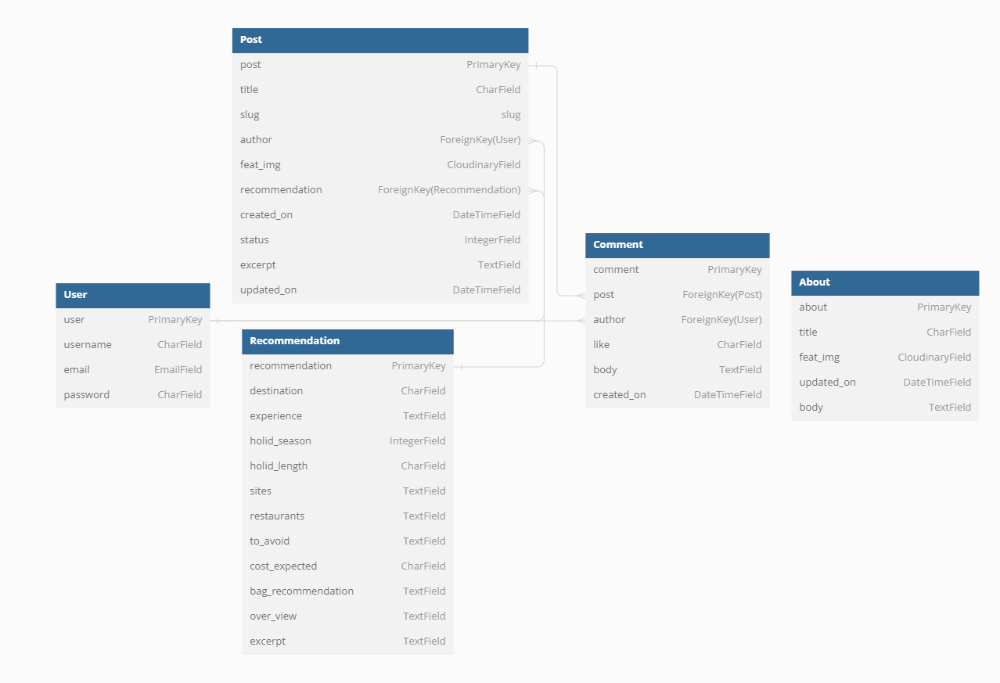
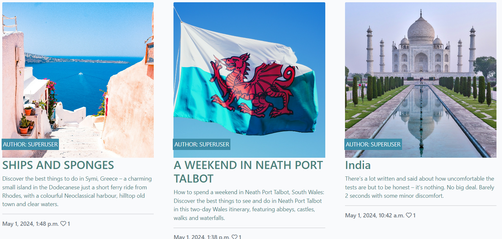

# Holiday Dreams

This is a Web App where a user can read about peoples adventures of holidays they have experienced and also comment,
or like the post as well as post there own Dream Holiday experience.

The goal is to make the user aware of prices in different locations and what baggage people have taken in the different seasons.

Also see what locations and experience you as a adventurer would like to experience

## [Click here to view website](https://holiday-dreams-c63c9b39c29f.herokuapp.com/)

# About Holiday Dreams

1. Create a space where people with the same interest can share the experiences and opinions 
2. Create an environment that gives users some insight of planing there next holiday  
3. Share your holiday experience with others
4. A place that is created only for holiday bloggers

# UX

## User Stories

- First-time visitor

  - Clear visually appealing landing page that is descriptive
  - All posts have are displayed with a big image that will catch the attention of a user
  - Nav bar clearly showing how many pages there are
  - Can open a post and read it but can not comment or like it unless singed in

- Returning visitor

  - Will want to create an account 
  - Will post there own user posts 
  - Will comment and like other users post 
  - Will read a post or comment, like a blog on there spare time they have 

- Frequent user

  - Will want to sing up for the newsletter and competition
  - Will use the blogs info to make a informed decision of their next holiday
  - Will be a user that likes to blog regularly 

## Strategy

This Web App is created to provide a community of holiday bloggers sharing all there experiences of there travels,
other user will live some of these experiences trough reading other bloggers posts, as well create some of there own memories.

In the grand scheme of connecting people that share the same interest in traveling

## Scope

The Webb App Will :

- Have clear descriptive prompts and notifications 
- Allow a user to create an account
- Let a user log In or Log out
- Let a create a post 
- Let the user have full CRUD functionality of there own posts
- Let the user comment on like another user post
- Let the user have full CRUD functionality of there own comments
- The user will be able to sing up for a news letter as well be entered into a draw 

## Structure

The Webb App will be structured around full user experience in mind making posting simple and creating a community of holiday bloggers

## Wire Frames 

I have created a wire frame of what I expected the Webb app to look like, but as development was carried out I have made some changes to the design which was more practical and appropriate for what the web app 

 Home Page

 About Page

 Login Page

 Sing Up Page

 User Logged in Page

 User Logged in Reading Post Page

 User Create a Post Page

 User Profile Posts Page

## Database diagram

This is a diagram of the models it has been altered during development and not all models were implemented and others where created instead to create a more user friendly experience.
The recommendation model was removed and instead some of the fields was incorporated into the post field it made more sense to me at the time to do it this way after with full user UX in mind.
I have added a Like model after to create a user interaction with a post.

 Database diagram

## Data Models

1. AllAuth user Model 
- It is a default model used by Django authentication
- It comes with Standard login user authentication promoting the user to log in or sign up
- Is is a one to many relationship with user post as the user can have many post but the post has only one author, each post will be authenticated to see if the user is logged in and singed up (checks if the user exists)

2. Post model
- Is is a one to many relationship with user post as the user can have many post but the post has only one author 
- the post model will prompt a user to populate some fields from the user's end but will also have a few auto filled fields 
- The author field will be used as a ForeingKey tht will be the main link to a user
- Fields the user can fill out are title, holiday_season, holiday_length, experience, bag_recommendation, excerpt cost_expected, featured_img
- Fields that will be auto generated author, slug, created_on, status, updated_on 

3. Comment model
- Will allow a verified log in user to comment on another user post
- This is a many to many relationship towards a post but a many to one relationship regards to a single user
- This model will use post and author as foreigner for verification of a user as well as linking the comment to the user that left the comment
- The body field will be populated by the user
- created_on Will be auto generated with a time and date of when a user made a comment

4. Like model
- The user and post field are ForeingKeys used to insure a user can only like a post once but a post can be liked by many users
- This is a many to many relationship towards a post but a many to one relationship regards to a single user

5. About Model 
- It has fields that can only be populated by a superuser to maintain a high standard of the Web app
- It will give the superuser the ability to add a custom about picture as well custom about description 

6. Subscribe model
- The fields of this model will be populated by a user 
- The information the user submits will only be accessible by the superuser as this may be sensitive data

## Agile Methodology

This the principal I used creating the Wbb App focussed on users stories and would only be marked as complete when t the user stories was met to a satisfactory standard 

### Epics

Epics where used to categorize the different user stories 
- Epic 1 : Visitor
- Epic 2 : User
- Epic 3 : Administrator and site management

The user stories would also have task that needs to completed and this is categorized by using
- Must have
- Should have 
- Could have

However I could have payed more attention to this board and update progress on it more frequently which I will do in the future

[Project Board](https://github.com/users/IainJackson90/projects/3)

 User Stories Template

 User Stories Issues

 Project Board

## Color pallet of the App
I created the Webb App with the mindset of creating a relaxing ambiance by using natural neutral colors that give you a feeling of having a holiday ith good weather and gets you not too overwhelmed and hopefully gets the user to blog or read some post.
I used three colors in this web App and tried sticking to the 60, 30, 10 rule of using colors.

- Ten percent more or less of the color #34A426
- Ten thirty more or less of the color #48817A
- Ten sixty more or less of the color #3C8CA7

 Color pallet

# Features

Each Feature was designed to be as user friendly as possible with a clear direction of what is expected from them trough use of visual notifications
All these feature ma differ dependant on the size of the device being used to view the web app

## Existing Features

 Nav Bar

- The Navbar will be displayed right at the top of each page
- Once  click on the Holiday Dreams logo it will redirect the user back to the home page 
-  The Nav bar at the top of the page has the logo as well as the navigation tabs as well as the slogan on the far right
- The Page tab you are on will be displayed in a darker font
- The slogan on the far right has no functionality 

 Hero Image

- The hero image is visually descriptive setting a ambience of adventure and relaxation as wel as traveling and holiday vibes
- At the top of the hero image on th far right will be a notification displayed in green to notify the user if they are logged in or not 
- In hte centre of the hero image is a short description of what to expect from the Web App
- The button on the hero image will let a signed in user add there own post but if you have not singed int the button will direct the user to the log in or sign up page

 Notifications

- Whenever the user logs in, logs out perform any kind of CRUD functionality there will be a notification pop up informing them of any changes they have made 
- The message will be clear of the type of action that has been performed by the user 

 Model

- Whenever the user wants to delete comment a model will pop up confirming the user with a message of the action they are doing and if they are sure they want to continue with this action 
- The buttons on the model change colors when you hover over them

 Post Delete

- When a user wants to delete there post they will be prompt with this page making sure of the users actions
- The buttons change color when you hover over them

 Posts

- The Body of the page under the hero image is where all the post will displayed with captivating images in a libary style effect to draw a user attention to the posts
- The post will display from the latest to the oldest posts
- On each image will be a banner at the bottom left displaying the author of the post
- Under the image will be a title of of the post 
- Under the title will be as hort excerpt of what you could expect of reading the post
- Under the excerpt will be a line separating the time and date the post was published as wel as how many likes the post have got
- When you hover over the excerpt text it will change color to green  

 Create a post

- When the user clicks on the create a oust button it will direct them to the CREATE A POST page
- This page has field so be populated by the blogger and is created for a more serious blogger giving them all the tools they need to create the perfect blog 
- Some of the text field will have text editing tools
- The blogger can add a image for the home page 
- The submit and cancel button changes colors when hover over them

 Reading a post

- At the top of each post when opened you will introduced by banner with the title and the author who created the post as well as a image the author has added

 Reading a post At the bottom

- At the bottom of a post created by the author will be two buttons that will give them a option to edit or delete the post they have created.
These buttons will ot be visible to any other user that is not the creator of the post, they also change color when you hover over them 
- There is a like icon that is not a full color red if the user did not click on it once it has been clicked on it will change color to a full red and the count next to it will increase by one this can only be done once on a post per user if it is clicked again it will remove one count on the counter as well change color back to a empty red color.
You can only use the like button if you are logged in as a user
- Next to the like icon there is a comment icon with a counter next to it displaying how many comment the post has
- Underneath the icon separated by a line are the comments posted by other users with the user name as well as the time and date it was created
- The delete and edit button will only be visible to the author of the comment giving them full Crud functionality of there comments, the buttons change color when you hover over them
- On the right is text area only visible if you are logged in as a user giving you the opportunity to submit a comment the submit button also changes color when you hover over it 
- Each comment posted will increase the comment counter and each comment deleted will remove a count off the comment counter 

 Footer

- At the bottom of the page above the footer will be a button that will help you navigate trough the pages to older posts that hse been created( A page will need nine post before it will create another page)
- When you hover over the button the text will to change color to green
- The footer has all the social media links that will direct you the social accounts of this Web App 
- When you hover over the social icons they will pop up with a zoom in effect

 About Page

- The about page will have a description of what the Webb App is about also with a timestamp when last the about content last was updated 
- There are some fields that if the user wants to sign up for the news letter they could do so
- the submit button changes color when you hover over it

 Sing Out Page

- If the user wants to log out they will be directed to the Sign out page 
- The button changes color when you hover over it

 Sing In Page

- When a user wants to sign up or log in they will be brought to this page
- The sing up displayed in a different color is a link to a sign up page 
- The color of the button changes color when you hover over it

 Sing Up Page

- When the user clicked on the sign up link on the Sing in form it will direct them to this page
- This page will prompt the user with clear information of what is required from the to create an account

 404 - Page not found page

- This is a custom 404 page not found page that will appear if the user request a page that can not be found
- It displays a clear message to the user of what just happened
- The button will redirect the user to the home page
- The button changes color when you hover over it 

 500 - Internal server error page

- This is a custom 500 internal server error page that will appear if there is a server error
- It displays a clear message to the user of what just happened
- The button will redirect the user to the home page
- The button changes color when you hover over it 

## Future Features

- Create a my profile or the users that sing up
- Have a search feature for a user that is singed in
- Have a report feature to report inappropriate blogs, and comments
- Add a admin Profile to the Webb app with some admin powers to monitor the web app
- Add a announcement page where winners of the draw could be displayed 
- Bug report Page
- Updated more user friendly create a post form
- Better layout for the sign up page

# Testing

The testing will be done manually

## Known Bugs

1. The Hero image might have too mush hight on smaller devices
2. The Post on the home page are big (not sure if I like it that way or if I want to change it, if I had a user base audience this could be reviewed)
3. When a user leaves a comment and refreshes the page web browser it will duplicate there comment 

## Fixed Bugs

1. I originally wanted to have a dropdown of different seasons on the create a post page and I could only get it to accept a integer value witch was not working correctly so instead opted to use a text field 
2. At first i used a text fields for the create a post form but the text field did not alow for any paragraphs or spacing the text did not look pleasing at all, i then used summernote editors instead
3. The summernote editors in the create a post would be adaptive to smaller devices after a lot of research I figured out that I could customize summernote editor in the settings.py file
4. Other bugs are minor spacing of buttons and layouts that had been fixed 

## Manual Testing

| What was tested as a visitor | Result | Outcome |
|:---|---:|:---:|
| Navigation bar links | Viewed every page | Works as expected |
| The logo on the navigation bar | Takes you to the home page when clicked on | Works as expected|
| Clicking the Sign Up or Log in button | Takes yoy to the sign in page | Works as expected|
| Clicking on a post | Opens up the post | Works as expected |
| Clicked on the hart like icon | Nothing happened |Works as expected|
| Clicked on the navigation button at the bottom of the page | Took me to the next page | Works as expected |
| Clicked on the social links in th footer | Directs me to the social pages | Works as expected |
|Sign up to be a user | Shows I am now signed with user name notification | Works as expected |

| What was tested as a User | Result | Outcome |
|:---|---:|:---:|
| Clicked on the add a post button | Directed me to the create a post page | Works as expected |
| Clicked on the cancel button on the create a post page | Directed me to the home page | Works as expected |
| Populated all the fields and clicked on the Submit button on the create a post page | Post was added | Works as expected |
| Clicked on the like button | added a like or removed it it | Works as expected |
| Clicked on the edit post button | Could edit the post I created | Works as expected |
| Clicked on the delete post button  | Deleted the post | Works as expected |
| Populated the comment text area and clicked the submit button | Created a comment underneath the post|Works as expected |
| Clicked on the delete button on the comments | Deleted the comment | Works as expected |
| Clicked on the edit button on the comments | could edit the comment | Works as expected |
| Populated the fields on the about page and clicked the submit button | Submitted successfully | Works as expected |
| Signed out button was clicked | Singed me out and directed me to the home page | Works as expected |

| Notifications and errors | Result | Outcome |
|:---|---:|:---:|
| You are not logged in | Notified when you are not logged in | Works as expected |
| You have signed out | Notified when you have signed out | Works as expected |
| Successfully signed in as ... | Notified when you have signed in | Works as expected |
| You are logged in as ... | Notified who you are signed in as | Works as expected |
| Your post has been shared success! | Notified that post was created successful | Works as expected |
| Your post has been updated successfully! | Notified that post was updated successful | Works as expected |
| Comment was posted sucsefully | Notified that comment was successful | Works as expected |
| Comment was successfully updated! | Notified that comment was updated successful | Works as expected |
| Are you sure you want to delete your comment? This action cannot be undone. | Notified that before comment was deleted | Works as expected |
| Comment deleted! | Notified that comment was deleted successful | Works as expected |
| Are you sure you want to delete this post? This can not be undone!!  | Notified that before Post was deleted | Works as expected |
| Your post has been deleted successfully! | Notified that post was deleted successful | Works as expected |
| Subscribed successfully! | Message after singing up for the news letter | Works as expected |
| 404 - PAGE NOT FOUND | When searching for a page that does not exist | Works as expected |

| Layout and built in functionality | Result | Outcome |
|:---|---:|---:|
| Posts | Viewed from latest to oldest | Works as expected |
| Time stamps | Views the time a post or comment is created | Works as expected|
| Like ikon on index home page | Displays the correct count of likes | Works as expected|
| Comment counter | Counts the correct amount of comments | Works as expected |
| Author banner | Shows the correct author |Works as expected|

## Validator Testing

# Deployment

## Heroku

1. Login to Heroku
2. On the Heroku dashboard click on 'New'
3. Select 'Create New App'
4. Add an app name (Must be a unique name) and select your region
5. Click 'Create App'

#### Prepare the workspace environment & settings.py

1. Create an env.py, requirements.txt & Procfile in the main directory of your GitPod workspace
2. Add the DATABASE_URL value and your chosen SECRET_KEY value to the env.py
3. Import the env.py file in your settings.py file and add the SECRETKEY and DATABASE_URL file paths
4. Comment the default database configuration out
5. Save files, make migrations and migrate
6. Add the Cloudinary URL to the env.py file
7. Add the Cloudinary libraries to the list of installed apps in settings.py
8. Add the STATIC files settings - the url, storage path, directory path, root path, media url and default file storage path
9. Link the file to the templates directory in Heroku
10. Change the templates directory to TEMPLATES_DIR
11. Add Heroku to the ALLOWED_HOSTS list in settings.py ['app_name.heroku.com', 'localhost']
12. In settings.py ensure DEBUG = False

#### Ensure the following Config Vars are added in Heroku

1. SECRET_KEY - Any Django secret key
2. CLOUDINARY_URL - Your Cloudinary API key
3. PORT = 8000
4. DISABLE_COLLECTSTATIC = 1 - this is temporary, will be removed for the final deployment
5. DATABASE_URL - Your ElephantSQL database URL
#### Heroku to deploy

1. At the top of the page again, click 'Deploy'
2. Click on 'Github' as your deployment method
3. Search the relevant repo and link these
4. Once linked, select 'Automatic deploys from' or 'Manual Deploy' (Manually deployed branches will need re-deploying each time the GitHub repository is updated)
5. The app will now be hosted on Heroku
6. Click 'Open App' to view the deployed site.

## ElephantSQL (Database)

1. Login to ElephantSQL
2. Click Create New Instance to create a new database
3. Provide a name, usually the project name would be used here
4. Select the Free plan
5. Select your closest Region and Data Center
6. Once created, click on the newly created database name
7. The database URL and Password can be viewed here.

## Cloudinary (Databse that stores the images)
The API platform has been used to store images uploaded by users of the webpage
1. Login to Cloudinary
2. In the Dashboard, you can copy your API Environment Variable
3. Be sure to remove the CLOUDINARY_URL= as part of the API value; this is the key in Config vars.

- ## _Cloning the GitHub repository_

This will download a full copy to your desktop

1. Log into GitHub
2. Find the repository you wish to clone
3. Find the green code button top right corner
4. Select "Local", copy the HTTPS URL
5. Go to Gitpod Workspace and navigate to "New Workspace"
6. Paste the URL into the space provided
7. Click "Create"

- ## _Forking the GitHub repository_

Will allow you to create a copy of the repository so changes can be made that will not affect the original repository.

1. Log into GitHub
2. Find the repository you wish to fork
3. Find the "Fork" drop down in the top right corner second from last
4. Select "Create"  

# Technologies Used

- [HTML5](https://en.wikipedia.org/wiki/HTML5) For the front end
- [CSS](https://en.wikipedia.org/wiki/CSS) For some styling of the html
- [JavaScript](https://en.wikipedia.org/wiki/JavaScript) For some functionality of the webpage
- [Python](https://en.wikipedia.org/wiki/Python_(programming_language)) main language used

- [Bootstrap](https://getbootstrap.com/) Layout and styling
- [Django](https://www.djangoproject.com/) Template
- Crispy forms Form templates 
- [Summernote](https://summernote.org/) For form templates

- [Git](https://git-scm.com/) Version control
- [Github](https://github.com/) storing files online and for deployment
- [Heroku](https://www.heroku.com/) to deploy the WebApp
- [elephantsql](https://www.elephantsql.com/) For database 
- [Cloudinary](https://cloudinary.com/) Used for online static file storage

- [CI Python Linter](https://pep8ci.herokuapp.com/) Validate the code
- [amiresponsive](https://ui.dev/amiresponsive) to check responsiveness
-  For
-  For 
-  For
-  For
-  For
-  For 
-  For

- [Wire Frames](https://balsamiq.com/) For wire Frames
- [dbdiagram](https://dbdiagram.io/home) For Database mockup
- [Snipping Tool](https://freesnippingtool.com/download) to create sniped images
- [colors tool](https://coolors.co/34a426-48817a-3c8ca7) Create color pallet

-  For
-  For 
-  For
-  For
-  For
-  For 
-  For

# Credits

- Code Institute for the learning content provided
- Harry Dhillon my assigned mentor to give advise on the project
- Juliia stand in mentor while Harry was away
- Nicole Jackson my wife a student at code institute for constructive criticism
- Blog Walk Trough project

- [Slack Comunity](https://github.com/roc-11/pp4-jetset-journal) roc-11
- [Slack Comunity](https://github.com/KimBergstroem/gamers_insight-CRUD-Blog-App) KimBergstroem
- [Slack Comunity](https://github.com/helenmurugan/the-groomers-network?tab=readme-ov-file) helenmurugan
- [Slack Comunity](https://app.slack.com/client/T0L30B202/search) Congiguring summernote

- [stackoverflow](https://stackoverflow.com/questions/61058107/remove-char-from-the-required-field-label-in-form ) Removing the astrix from crispy forms 
- [stackoverflow](https://stackoverflow.com/questions/68968059/how-can-i-allow-users-to-create-their-own-posts-in-django) how to create user posts

- [w3schools](https://www.w3schools.com/howto/howto_css_hero_image.asp) Hero image coding help

- [sarahtitus](https://www.sarahtitus.com/25-best-travel-destinations-color-palettes/) For color pallet insperation
- [backpackMe](https://bkpk.me/traveling-to-india-during-covid-19-restrictions/) TRAVELING TO INDIA DURING COVID-19 RESTRICTIONS
- [On The Luce](https://www.ontheluce.com/weekend-in-neath-port-talbot-wales/) A WEEKEND IN NEATH PORT TALBOT, WALES: 2-DAY ITINERARY
- [On The Luce](https://www.ontheluce.com/things-to-do-in-symi-greece/) SHIPS AND SPONGES: THE BEST THINGS TO DO IN SYMI, GREECE

- [pexels](https://www.pexels.com/photo/lake-and-mountain-417074/) Hero image
- [unsplash](https://unsplash.com/s/photos/placeholder) For Placeholder iamge
- [Unsplash](https://unsplash.com/photos/green-artificial-palm-tree-on-seashore-7RyfX2BHoXU) For about image
- [font awsome](https://fontawesome.com/v5/icons/twitter?f=brands&s=solid) For icons
