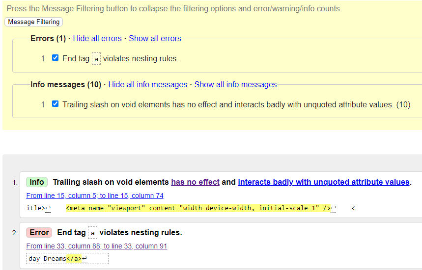
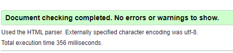
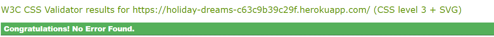
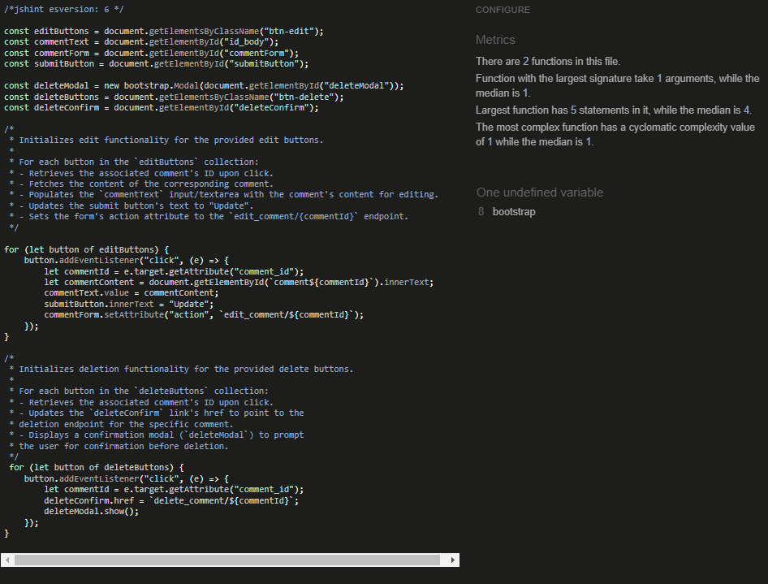
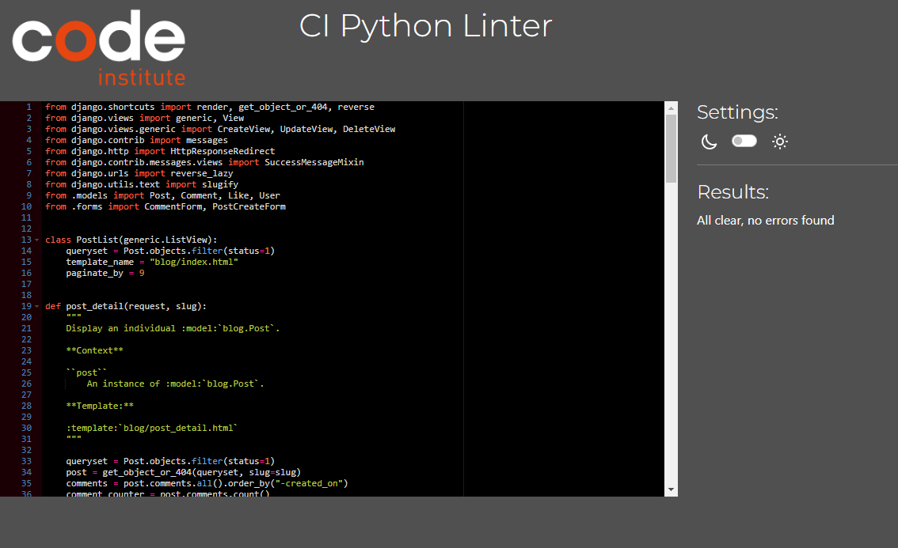

# Holiday Dreams | Testing

Back to the [README.md](https://github.com/IainJackson90/pp4-holiday-dreams/blob/main/README.md)

# Testing

The testing will be done manually

## Known Bugs

1. The Hero image might have too much higher on smaller devices
2. The Post on the home page are big (not sure if I like it that way or if I want to change it, if I had a user base audience this could be reviewed)
3. When a user leaves a comment and refreshes the page web browser it will duplicate there comment 
4. Django admin panel the post model, experience field and the about model, body field the summernote text editor is a bit small

## Fixed Bugs

1. I originally wanted to have a dropdown of different seasons on the create a post page and I could only get it to accept a integer value which was not working correctly so instead opted to use a text field 
2. At first i used a text fields for the create a post form but the text field did not allow for any paragraphs or spacing the text did not look appealing at all, i then used summernote editors instead
3. The summernote editors in the create a post would be adaptive to smaller devices after a lot of research I figured out that I could customize summernote editor in the settings.py file
4. Other bugs are minor spacing of buttons and layouts that had been fixed 

## Manual Testing

| What was tested as a visitor | Result | Outcome |
|:---|---:|:---:|
| Navigation bar links | Viewed every page | Works as expected |
| The logo on the navigation bar | Takes you to the home page when clicked on | Works as expected|
| Clicking the Sign Up or Log in button | Takes you to the sign in page | Works as expected|
| Clicking on a post | Opens up the post | Works as expected |
| Clicked on the hart like icon | Nothing happened |Works as expected|
| Clicked on the navigation button at the bottom of the page | Took me to the next page | Works as expected |
| Clicked on the social links in the footer | Directs me to the social pages | Works as expected |
|Sign up to be a user | Shows I am now signed with username notification | Works as expected |

| What was tested as a User | Result | Outcome |
|:---|---:|:---:|
| Clicked on the add a post button | Directed me to the create a post page | Works as expected |
| Clicked on the cancel button on the create a post page | Directed me to the home page | Works as expected |
| Populated all the fields and clicked on the Submit button on the create a post page | Post was added | Works as expected |
| Clicked on the like button | added a like or removed it it | Works as expected |
| Clicked on the edit post button | Could edit the post I created | Works as expected |
| Clicked on the delete post button  | Deleted the post | Works as expected |
| Populated the comment text area and clicked the submit button | Created a comment underneath the post|Works as expected |
| Clicked on the delete button on the comments | Deleted the comment | Works as expected |
| Clicked on the edit button on the comments | could edit the comment | Works as expected |
| Populated the fields on the about page and clicked the submit button | Submitted successfully | Works as expected |
| Signed out button was clicked | Signed me out and directed me to the home page | Works as expected |

| Notifications and errors | Result | Outcome |
|:---|---:|:---:|
| You are not logged in | Notified when you are not logged in | Works as expected |
| You have signed out | Notified when you have signed out | Works as expected |
| Successfully signed in as ... | Notified when you have signed in | Works as expected |
| You are logged in as ... | Notified who you are signed in as | Works as expected |
| Your post has been a shared success! | Notified that post was created successful | Works as expected |
| Your post has been updated successfully! | Notified that post was updated successful | Works as expected |
| Comment was posted successfully | Notified that comment was successful | Works as expected |
| Comment was successfully updated! | Notified that comment was updated successful | Works as expected |
| Are you sure you want to delete your comment? This action cannot be undone. | Notified that before comment was deleted | Works as expected |
| Comment deleted! | Notified that comment was deleted successful | Works as expected |
| Are you sure you want to delete this post? This can not be undone!!  | Notified that before Post was deleted | Works as expected |
| Your post has been deleted successfully! | Notified that post was deleted successful | Works as expected |
| Subscribed successfully! | Message after signing up for the newsletter | Works as expected |
| 404 - PAGE NOT FOUND | When searching for a page that does not exist | Works as expected |

| Layout and built in functionality | Result | Outcome |
|:---|---:|---:|
| Posts | Viewed from latest to oldest | Works as expected |
| Time stamps | Views the time a post or comment is created | Works as expected|
| Like ikon on index home page | Displays the correct count of likes | Works as expected|
| Comment counter | Counts the correct amount of comments | Works as expected |
| Author banner | Shows the correct author | Works as expected |
| Title can not be the same | Does not create a post with the same title | Works as expected |

## Validator Testing

### Responsiveness

The responsiveness of the Webb ap was tested using "Am I Responsiveness"

 Failed the first HTML validation I did this was the result

### HTML Validation

My html does contain comments to make it more easy for navigating through the html pages

 Failed the first HTML validation I did this was the result

 Passed the Second HTML validation 

### CSS

My CSS has no errors but do have warnings which are used for webkits

 Passed the CSS validation 

### Java Script

My javascript passed the validation

 Passed the javascript validation 

### Python 

My python code has no error here is a example of how it has been tested

 Passed the Python validation 

###

Back to the [README.md](https://github.com/IainJackson90/pp4-holiday-dreams/blob/main/README.md)